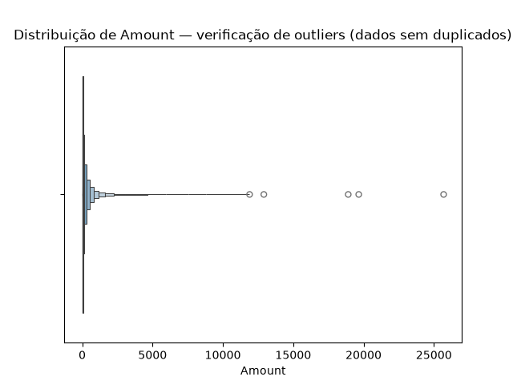

# Como Ler Gráficos — Guia de Estudo

> Este documento reúne explicações de como interpretar os principais gráficos usados em
> projetos de análise de dados. A ideia é ir adicionando um gráfico por vez, conforme forem
> aparecendo no projeto, para consultar sempre que precisar relembrar como ler cada um.

---

## Índice

- [Boxplot](#boxplot)
- *(próximos gráficos entram aqui conforme forem estudados: histograma, curva ROC, curva
  Precision-Recall, gráfico de importância de variáveis, SHAP, etc.)*

---

## Boxplot

### O que ele mostra

O boxplot (ou "diagrama de caixa") resume a distribuição de uma variável numérica em 5
números-chave, permitindo visualizar de forma rápida onde a maioria dos dados se concentra,
o quão espalhados eles estão, e quais valores fogem do padrão.

### Anatomia do gráfico



*Este é o próprio gráfico gerado no projeto (distribuição de `Amount`). Olhando de perto, é
possível notar que existem **vários retângulos azuis aninhados**, não só um — isso significa
que o gráfico gerado é, na verdade, um **boxenplot** (explicado na próxima seção), não um
boxplot tradicional. A leitura básica é a mesma, só a "caixa" vira "várias caixas":*

| Elemento | Onde está neste gráfico | O que representa |
|---|---|---|
| **Caixas (retângulos azuis aninhados)** | Os vários retângulos concêntricos, do maior/mais claro ao menor/mais escuro, comprimidos perto do zero | Juntos, contêm a maior parte dos dados — o retângulo mais central e escuro representa os 50% "mais típicos" (equivalente à caixa de um boxplot comum) |
| **Linha central** | Linha vertical no meio dos retângulos | A **mediana** (valor central, 50% dos dados) |
| **Whiskers (linhas horizontais que saem das caixas)** | As linhas pretas finas que se estendem até ~4000-5000 | Mostram até onde os dados ainda são considerados dentro do padrão |
| **Círculos soltos além dos whiskers** | Os 5-6 círculos isolados entre ~12000 e ~26000 | **Outliers** — valores estatisticamente distantes do restante dos dados |

### Como calcular os limites (por trás do gráfico)

- **IQR (Intervalo Interquartil)** = Q3 − Q1 (o "tamanho" da caixa)
- **Limite inferior** = Q1 − 1.5 × IQR
- **Limite superior** = Q3 + 1.5 × IQR
- Qualquer valor além desses limites é marcado como outlier (círculo solto no gráfico)

### O que diferentes formatos revelam

| Formato do boxplot | O que indica |
|---|---|
| Caixa centralizada, whiskers simétricos, poucos/nenhum outlier | Distribuição próxima da normal (simétrica) |
| Caixa comprimida perto de um lado, cauda longa de outliers do outro | Distribuição assimétrica (*skewed*) — comum em variáveis como valores monetários |
| Caixa muito estreita | Dados pouco dispersos, concentrados perto da mediana |
| Caixa muito larga | Dados bastante dispersos |
| Muitos outliers | Pode indicar erros de coleta **ou** um padrão real que merece investigação (depende do contexto) |

### Boxenplot (letter-value plot) — a variação usada neste projeto

O **boxenplot** é uma variação do boxplot, pensada para datasets grandes (como o deste
projeto, com quase 285 mil linhas). Em vez de mostrar uma única caixa (só com Q1, mediana e
Q3), ele desenha **várias caixas aninhadas**, cada uma menor que a anterior, representando
níveis adicionais de percentis (não só 25%/50%/75%, mas também 12,5%, 6,25%, e assim por
diante, conforme se aproxima do centro).

**Por que usar boxenplot em vez de boxplot comum:**
- Um boxplot tradicional só mostra 3 pontos de referência (Q1, mediana, Q3) — em datasets
  muito grandes, isso "esconde" detalhes de como os dados se distribuem dentro da própria
  caixa
- O boxenplot revela mais nuance dessa distribuição interna, sem perder a leitura de
  outliers, que continua funcionando do mesmo jeito

**Como ler:** o retângulo mais largo e mais claro é o mais "externo" (equivale a uma faixa
maior de percentis); os retângulos vão ficando mais estreitos e escuros conforme se
aproximam do centro, representando a concentração real dos dados. Os outliers continuam
sendo os círculos soltos nas extremidades, com a mesma interpretação de sempre.

**Como gerar (Python / seaborn):**
```python
sns.boxenplot(x=df["nome_da_coluna"])
```

> ⚠️ Fácil de confundir com `sns.boxplot()` pelo nome parecido — vale conferir qual função
> foi usada quando o gráfico tiver mais de uma caixa aparecendo.

### Boxplot comparativo (por categoria)

É muito comum usar boxplots lado a lado, separados por uma variável categórica (ex: uma
variável numérica comparada entre duas classes). Nesse caso, o objetivo é comparar:

- As **medianas** são parecidas ou diferentes entre os grupos?
- A **dispersão** (tamanho da caixa) é parecida?
- Um grupo tem muito mais outliers que o outro?

Isso ajuda a identificar se aquela variável comporta-se de forma diferente entre as
categorias — um indício de que ela pode ser relevante para diferenciar os grupos.

### Cuidado importante na interpretação

Outlier **não significa automaticamente "erro" ou "dado ruim"**. Antes de decidir remover um
outlier, vale perguntar:

1. É um erro de digitação ou coleta? → Nesse caso, faz sentido corrigir ou remover
2. É um valor real, só que raro? → Nesse caso, remover pode apagar informação importante,
   especialmente se esse valor raro for justamente o que se está tentando identificar (ex:
   fraudes, casos extremos, eventos incomuns)

A EDA (comparando o outlier com outras variáveis, como uma categoria de interesse) costuma
ajudar a diferenciar os dois casos antes de decidir o que fazer com eles.

### Como gerar (Python / seaborn)

```python
import seaborn as sns
import matplotlib.pyplot as plt

sns.boxplot(x=df["nome_da_coluna"])
plt.title("Título do gráfico")
plt.show()

# Comparando por categoria
sns.boxplot(x="coluna_categoria", y="coluna_numerica", data=df)
plt.show()
```

---

*Próxima entrada: adicionar explicação de histograma, assim que ele aparecer no projeto.*