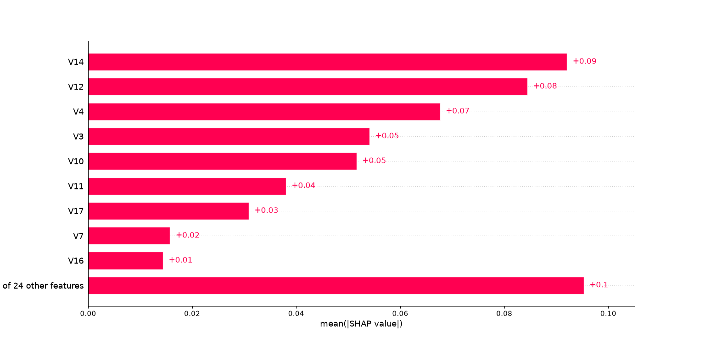
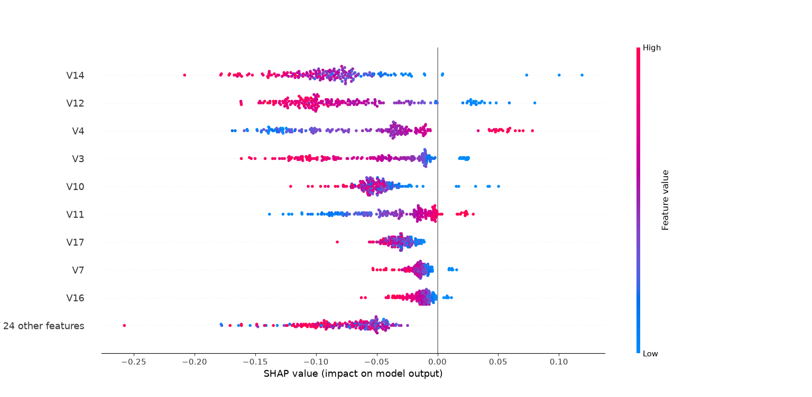
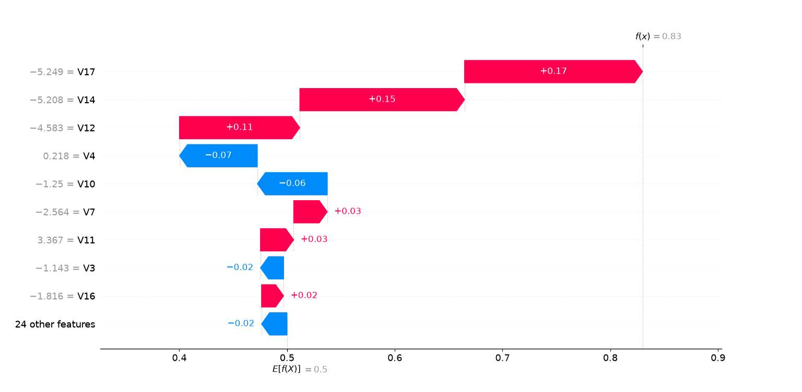
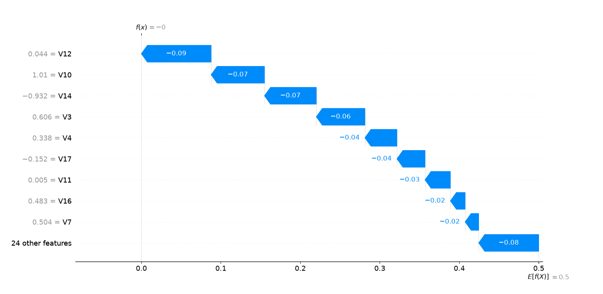
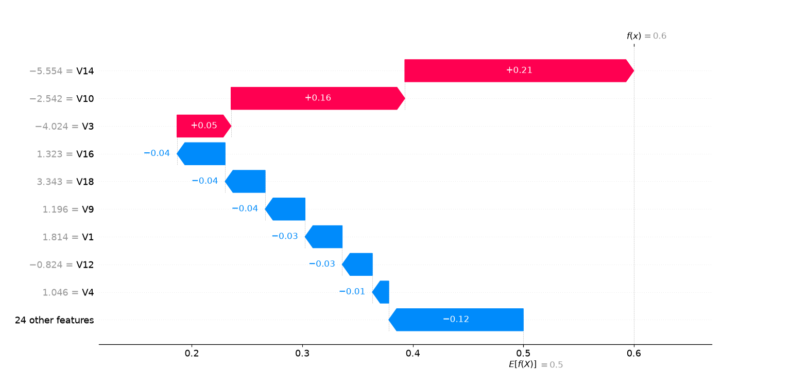

# Como Ler Gráficos — Guia de Estudo

> Este documento reúne explicações de como interpretar os principais gráficos usados em
> projetos de análise de dados. A ideia é ir adicionando um gráfico por vez, conforme forem
> aparecendo no projeto, para consultar sempre que precisar relembrar como ler cada um.

---

## Índice

- [Boxplot](#boxplot)
- [SHAP — Importância global (bar plot)](#shap--importância-global-bar-plot)
- [SHAP — Importância + direção (beeswarm)](#shap--importância--direção-beeswarm)
- [SHAP — Casos individuais (waterfall)](#shap--casos-individuais-waterfall)
- *(próximos gráficos entram aqui conforme forem estudados: histograma, curva ROC, curva
  Precision-Recall, etc.)*

---

## Boxplot

### O que ele mostra

O boxplot (ou "diagrama de caixa") resume a distribuição de uma variável numérica em 5
números-chave, permitindo visualizar de forma rápida onde a maioria dos dados se concentra,
o quão espalhados eles estão, e quais valores fogem do padrão.

### Anatomia do gráfico


*Este é o próprio gráfico gerado no projeto (distribuição de `Amount`). Olhando de perto, é
possível notar que existem **vários retângulos azuis aninhados**, não só um — isso significa
que o gráfico gerado é, na verdade, um **boxenplot** (explicado na próxima seção), não um
boxplot tradicional. A leitura básica é a mesma, só a "caixa" vira "várias caixas":*

| Elemento | Onde está neste gráfico | O que representa |
|---|---|---|
| **Caixas (retângulos azuis aninhados)** | Os vários retângulos concêntricos, do maior/mais claro ao menor/mais escuro, comprimidos perto do zero | Juntos, contêm a maior parte dos dados — o retângulo mais central e escuro representa os 50% "mais típicos" (equivalente à caixa de um boxplot comum) |
| **Linha central** | Linha vertical no meio dos retângulos | A **mediana** (valor central, 50% dos dados) |
| **Whiskers (linhas horizontais que saem das caixas)** | As linhas pretas finas que se estendem até ~4000-5000 | Mostram até onde os dados ainda são considerados dentro do padrão |
| **Círculos soltos além dos whiskers** | Os 5-6 círculos isolados entre ~12000 e ~26000 | **Outliers** — valores estatisticamente distantes do restante dos dados |

### Como calcular os limites (por trás do gráfico)

- **IQR (Intervalo Interquartil)** = Q3 − Q1 (o "tamanho" da caixa)
- **Limite inferior** = Q1 − 1.5 × IQR
- **Limite superior** = Q3 + 1.5 × IQR
- Qualquer valor além desses limites é marcado como outlier (círculo solto no gráfico)

### O que diferentes formatos revelam

| Formato do boxplot | O que indica |
|---|---|
| Caixa centralizada, whiskers simétricos, poucos/nenhum outlier | Distribuição próxima da normal (simétrica) |
| Caixa comprimida perto de um lado, cauda longa de outliers do outro | Distribuição assimétrica (*skewed*) — comum em variáveis como valores monetários |
| Caixa muito estreita | Dados pouco dispersos, concentrados perto da mediana |
| Caixa muito larga | Dados bastante dispersos |
| Muitos outliers | Pode indicar erros de coleta **ou** um padrão real que merece investigação (depende do contexto) |

### Boxenplot (letter-value plot) — a variação usada neste projeto

O **boxenplot** é uma variação do boxplot, pensada para datasets grandes (como o deste
projeto, com quase 285 mil linhas). Em vez de mostrar uma única caixa (só com Q1, mediana e
Q3), ele desenha **várias caixas aninhadas**, cada uma menor que a anterior, representando
níveis adicionais de percentis (não só 25%/50%/75%, mas também 12,5%, 6,25%, e assim por
diante, conforme se aproxima do centro).

**Por que usar boxenplot em vez de boxplot comum:**
- Um boxplot tradicional só mostra 3 pontos de referência (Q1, mediana, Q3) — em datasets
  muito grandes, isso "esconde" detalhes de como os dados se distribuem dentro da própria
  caixa
- O boxenplot revela mais nuance dessa distribuição interna, sem perder a leitura de
  outliers, que continua funcionando do mesmo jeito

**Como ler:** o retângulo mais largo e mais claro é o mais "externo" (equivale a uma faixa
maior de percentis); os retângulos vão ficando mais estreitos e escuros conforme se
aproximam do centro, representando a concentração real dos dados. Os outliers continuam
sendo os círculos soltos nas extremidades, com a mesma interpretação de sempre.

**Como gerar (Python / seaborn):**
```python
sns.boxenplot(x=df["nome_da_coluna"])
```

> ⚠️ Fácil de confundir com `sns.boxplot()` pelo nome parecido — vale conferir qual função
> foi usada quando o gráfico tiver mais de uma caixa aparecendo.

### Boxplot comparativo (por categoria)

É muito comum usar boxplots lado a lado, separados por uma variável categórica (ex: uma
variável numérica comparada entre duas classes). Nesse caso, o objetivo é comparar:

- As **medianas** são parecidas ou diferentes entre os grupos?
- A **dispersão** (tamanho da caixa) é parecida?
- Um grupo tem muito mais outliers que o outro?

Isso ajuda a identificar se aquela variável comporta-se de forma diferente entre as
categorias — um indício de que ela pode ser relevante para diferenciar os grupos.

### Cuidado importante na interpretação

Outlier **não significa automaticamente "erro" ou "dado ruim"**. Antes de decidir remover um
outlier, vale perguntar:

1. É um erro de digitação ou coleta? → Nesse caso, faz sentido corrigir ou remover
2. É um valor real, só que raro? → Nesse caso, remover pode apagar informação importante,
   especialmente se esse valor raro for justamente o que se está tentando identificar (ex:
   fraudes, casos extremos, eventos incomuns)

A EDA (comparando o outlier com outras variáveis, como uma categoria de interesse) costuma
ajudar a diferenciar os dois casos antes de decidir o que fazer com eles.

### Como gerar (Python / seaborn)

```python
import seaborn as sns
import matplotlib.pyplot as plt

sns.boxplot(x=df["nome_da_coluna"])
plt.title("Título do gráfico")
plt.show()

# Comparando por categoria
sns.boxplot(x="coluna_categoria", y="coluna_numerica", data=df)
plt.show()
```

---

## SHAP — Importância global (bar plot)

### O que ele mostra

Esse gráfico responde a uma pergunta simples: **em média, quais variáveis mais pesam nas
decisões do modelo?** Ele resume, para cada variável, o quanto ela contribui (em média,
em valor absoluto) para empurrar as previsões do modelo — sem indicar a direção (isso fica
para o próximo gráfico, o beeswarm).



*Este é o gráfico gerado no projeto de detecção de fraude, mostrando quais variáveis mais
influenciam a decisão do modelo.*

### Anatomia do gráfico

| Elemento | Onde está neste gráfico | O que representa |
|---|---|---|
| **Eixo Y (nomes das variáveis)** | `V14`, `V12`, `V4`, `V3`, etc. | Cada barra é uma variável do modelo, ordenada da mais para a menos importante |
| **Comprimento da barra** | Quanto mais longa, mais à direita ela termina | O valor médio de `\|SHAP value\|` — o quanto aquela variável, em média, influencia a previsão (não importa a direção, só a magnitude) |
| **Número ao lado da barra** (ex: `+0.09`) | Rótulo no fim de cada barra | O valor exato de importância média daquela variável |
| **Última barra ("of 24 other features")** | Barra ao final, geralmente maior que as individuais | Soma da importância de todas as variáveis menos relevantes, agrupadas — evita poluir o gráfico com dezenas de barras pequenas |

### Como ler, na prática

- As variáveis no **topo** são as que mais pesam nas decisões do modelo, em média, considerando todas as previsões
- O valor numérico é sempre positivo aqui (é um valor absoluto) — isso porque este gráfico mede **quanto** cada variável importa, não **para que lado** ela empurra a decisão
- Se a última barra ("of N other features") for grande, isso indica que a decisão do modelo é **distribuída** entre muitas variáveis, não concentrada só nas primeiras

### Cuidado na interpretação

Esse gráfico **não diz se a variável aumenta ou diminui a chance de fraude** — só diz o
quanto ela "mexe" na decisão. Para saber a direção do impacto, é necessário o gráfico
**beeswarm** (próxima seção).

### Como gerar (Python / shap)

```python
import shap

explainer = shap.Explainer(modelo)
shap_values = explainer(X_test_amostra)

shap.plots.bar(shap_values[:, :, 1])  # [:, :, 1] = classe de interesse (ex: fraude)
```

---

## SHAP — Importância + direção (beeswarm)

### O que ele mostra

Esse é o gráfico mais rico dos dois: além de mostrar a importância de cada variável, ele
mostra **para que lado** ela empurra a previsão — ou seja, se valores altos ou baixos daquela
variável tornam o resultado mais ou menos propenso a ser classificado como a classe de
interesse (por exemplo, fraude).



*Este é o gráfico gerado no projeto, para a classe fraude.*

### Anatomia do gráfico

| Elemento | Onde está neste gráfico | O que representa |
|---|---|---|
| **Eixo Y (nomes das variáveis)** | `V14`, `V12`, `V4`, etc., mesma ordem de importância do bar plot | Cada linha é uma variável |
| **Eixo X (SHAP value)** | Vai de negativo (esquerda) a positivo (direita), cruzando o zero no meio | Indica a direção e a força do impacto: valores negativos empurram para **longe** da classe de interesse; valores positivos empurram **para** ela |
| **Cada ponto** | Uma bolinha colorida | Representa **uma transação individual** do conjunto de dados analisado — não uma média, um caso real |
| **Cor do ponto** | Azul (baixo) → Rosa/Magenta (alto), conforme a legenda à direita | O valor que **aquela variável específica** tinha, para aquela transação específica |
| **Posição horizontal dos pontos amontoados** | Onde os pontos se concentram numa mesma variável | Mostra o padrão predominante — por exemplo, se a maioria dos pontos rosa (valores altos) está à esquerda, isso indica que valores altos daquela variável tendem a reduzir a chance de fraude |

### Como ler, na prática

Pegando como exemplo a variável do topo (`V14`) no gráfico do projeto:
- Os pontos **rosa** (valores altos de V14) aparecem mais concentrados à **esquerda** (SHAP
  negativo) → valores altos de V14 empurram a previsão para **longe** de fraude
- Os pontos **azuis** (valores baixos de V14) aparecem espalhados mais à **direita**, inclusive
  nos extremos → valores baixos de V14 estão associados a maior chance de fraude

Repare que isso é **oposto** em outras variáveis (ex: `V4`, onde os pontos rosa aparecem mais
à direita) — cada variável pode ter uma relação diferente (direta ou inversa) com a classe de
interesse, e o beeswarm revela isso variável por variável.

### Cuidado na interpretação

- O beeswarm mostra o que o **modelo aprendeu**, não necessariamente uma relação de causa e
  efeito real no mundo — se o modelo aprendeu um padrão espúrio, o gráfico vai mostrá-lo com a
  mesma "confiança" visual de um padrão genuíno
- Quando as variáveis analisadas já vêm transformadas (ex: por PCA, como `V1`-`V28` neste
  projeto), a leitura é só **estatística** — dá para saber que "V14 baixo" está associado a
  fraude, mas não dá para saber *o que* V14 representa no mundo real

### Como gerar (Python / shap)

```python
shap.plots.beeswarm(shap_values[:, :, 1])  # [:, :, 1] = classe de interesse (ex: fraude)
```

---

## SHAP — Casos individuais (waterfall)

### O que ele mostra

Enquanto o bar plot e o beeswarm explicam o modelo **de forma geral**, o waterfall explica
**uma única previsão específica** — por exemplo, uma transação individual. Ele mostra, passo
a passo, como o modelo partiu de um valor "neutro" (a média geral de todas as previsões) até
chegar na previsão final daquele caso, e quanto cada variável contribuiu nesse caminho.

### Anatomia do gráfico

| Elemento | O que representa |
|---|---|
| **`E[f(X)]`** (linha pontilhada à esquerda ou embaixo) | O valor "base" — a previsão média do modelo, antes de considerar qualquer variável daquele caso específico |
| **`f(x)`** (no topo do gráfico) | A previsão final para aquele caso específico, depois de somar o efeito de todas as variáveis |
| **Barras rosa/magenta (apontando para a direita)** | Variáveis que **empurraram a previsão para cima** (mais próximo de "fraude", neste projeto) |
| **Barras azuis (apontando para a esquerda)** | Variáveis que **empurraram a previsão para baixo** (mais próximo de "normal") |
| **Número ao lado de cada barra** | O quanto aquela variável contribuiu, em pontos, para a previsão final |
| **Valor à esquerda do nome da variável** (ex: `-5.208 = V14`) | O valor real que aquela variável tinha, **nesta transação específica** |
| **"N other features"** (última barra) | Soma do efeito de todas as variáveis menos importantes, agrupadas |

### Como ler, na prática

Comece de baixo para cima (ou olhe a ordem das barras): cada uma "empurra" o valor um pouco
mais para a esquerda ou direita, até chegar no `f(x)` final, no topo. A leitura conta uma
história: *"o modelo partiu de uma expectativa neutra, e cada variável foi ajustando essa
expectativa até chegar no resultado final."*

### Exemplos reais do projeto — três casos comparados

**Caso 1 — Acerto de fraude** (fraude real, corretamente identificada):



Previsão final: `f(x) = 0.83`. As variáveis `V17`, `V14` e `V12` tinham valores bem
negativos e extremos (-5.2, -5.2, -4.6) — exatamente o padrão que o modelo associa fortemente
a fraude.

**Caso 2 — Falso negativo** (fraude real, que o modelo não detectou):



Previsão final: `f(x) ≈ 0`. Todas as barras são azuis — nada empurrou para fraude. Repare que
`V14 = -0.932` aqui é bem menos extremo que no caso de acerto — essa fraude não seguiu o
padrão "óbvio" que o modelo aprendeu, por isso passou despercebida.

**Caso 3 — Falso positivo** (transação normal, marcada como fraude por engano):



Previsão final: `f(x) = 0.6`. Aqui `V14 = -5.554` — um valor até mais extremo que o do acerto
de fraude! Essa transação normal, por coincidência, teve um valor de V14 tão baixo quanto o
de fraudes reais, o que confundiu o modelo.

### O que essa comparação revela

Colocando os três valores de `V14` lado a lado:

| Caso | V14 | Resultado |
|---|---|---|
| Acerto de fraude | -5.208 | Detectado corretamente |
| Falso negativo | -0.932 | Não detectado (valor pouco extremo) |
| Falso positivo | -5.554 | Marcado como fraude (valor extremo, mas era normal) |

Isso mostra que o modelo depende fortemente de `V14` estar muito negativo para "confiar" que
é fraude — o que funciona bem quando a fraude realmente segue esse padrão extremo, mas falha
tanto quando a fraude é mais "sutil" (falso negativo) quanto quando uma transação normal
coincidentemente tem esse mesmo padrão (falso positivo).

### Cuidado na interpretação

O waterfall explica **um caso específico**, não deve ser generalizado para "toda fraude se
comporta assim" — para conclusões gerais, o bar plot e o beeswarm continuam sendo as
ferramentas certas. O waterfall serve para **investigar casos pontuais**, especialmente
erros do modelo, entendendo o que levou àquela decisão específica.

### Como gerar (Python / shap)

```python
shap_values_caso = explainer(X_test.iloc[[indice_do_caso]])
shap.plots.waterfall(shap_values_caso[0, :, 1])  # [0, :, 1] = primeira linha, classe fraude
```

---

*Próxima entrada: adicionar explicação de histograma, curva ROC ou Precision-Recall, assim
que revisados no projeto.*