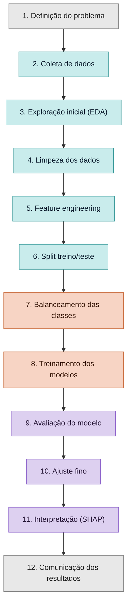

# Plano de Estudo — Fluxo Geral de um Projeto de Análise de Dados

Este documento resume o passo a passo geral seguido em um projeto de análise de dados,
do início (definição do problema) até o final (comunicação dos resultados). Serve como
guia de referência para organizar qualquer novo projeto de análise/ciência de dados.

---

## 1. Definição do problema

Antes de tocar em qualquer dado, é preciso deixar claro:

- **Qual é a pergunta de negócio ou de pesquisa?** (específica, não um tema genérico)
- **O problema é descritivo, preditivo ou prescritivo?**
  - *Descritivo*: entender o que aconteceu (geralmente EDA + estatística, sem ML)
  - *Preditivo*: prever algo que ainda não aconteceu (envolve modelagem)
  - *Prescritivo*: recomendar uma ação com base numa previsão
- **Qual é a variável alvo?** (se for preditivo) — define se é classificação ou regressão
- **Qual métrica define sucesso?** — depende do custo de cada tipo de erro no contexto
- **Quem vai usar o resultado, e como?** — define se o entregável final é código, relatório
  ou dashboard
- **Quais restrições existem?** (prazo, qualidade dos dados, necessidade de interpretabilidade)

> Resumo em uma frase: *"Este projeto busca [prever/entender] [o quê], usando [que tipo de
> dado], com o objetivo de [ação de negócio]. O sucesso será medido por [métrica], entregue
> como [formato]."*

---

## 2. Coleta de dados

- Identificar a fonte: banco de dados interno, arquivos (CSV/Excel/JSON), APIs, web
  scraping, formulários/pesquisas
- Validar se o dado é **representativo**, **suficiente**, **atual** e se há questões de
  **privacidade/permissão de uso**

---

## 3. Exploração inicial (EDA)

Objetivo: **conhecer o dado antes de tomar qualquer decisão** sobre ele.

1. **Visão estrutural**
   ```python
   df.shape
   df.info()
   df.describe()
   ```
2. **Qualidade dos dados** — nulos, duplicados, inconsistências de formato/tipo
3. **Distribuição de cada variável** — histogramas (numéricas), gráficos de barra
   (categóricas)
4. **Relação entre variáveis** — correlação (`df.corr()`), boxplots cruzados
5. **Se houver variável alvo**, olhar sua distribuição primeiro (ex: está balanceada?)

---

## 4. Limpeza dos dados (Data Cleaning)

| Problema | Como tratar |
|---|---|
| Valores nulos | Remover, imputar (média/mediana/moda) ou manter como indicador |
| Duplicados | `df.duplicated()` / `df.drop_duplicates()` |
| Outliers | Investigar se é erro (corrigir/remover) ou informação real (manter) |
| Inconsistências de formato | Padronizar texto, datas, categorias |
| Tipos de dado errados | Corrigir para `int`, `float`, `datetime`, `category`, etc. |

---

## 5. Feature Engineering

Cria ou transforma variáveis para que carreguem mais informação útil ao modelo:

- **Transformações matemáticas** (log, raiz quadrada) — suavizam distribuições assimétricas
- **Padronização/Normalização** — `StandardScaler` (média 0, desvio 1) ou `MinMaxScaler`
  (escala 0–1)
- **Codificação de categorias** — One-Hot Encoding (sem ordem) ou Label Encoding (com ordem)
- **Extração de novas variáveis** — ex: dia da semana a partir de uma data, razões entre
  colunas
- **Redução de dimensionalidade** (quando necessário) — ex: PCA

> Limpeza corrige problemas nos dados. Feature engineering adiciona valor aos dados.

---

## 6. Split treino/teste

Separa os dados em duas partes **antes de qualquer ajuste que "aprenda" com eles**
(balanceamento, normalização baseada em estatísticas do dado, treino do modelo):

```python
from sklearn.model_selection import train_test_split

X_train, X_test, y_train, y_test = train_test_split(
    X, y, stratify=y, test_size=0.3, random_state=42
)
```

- `stratify=y` mantém a proporção das classes igual em treino e teste
- Fazer isso fora de ordem (ex: normalizar antes de dividir) causa **data leakage**
- Em projetos maiores, pode existir também um conjunto de **validação**, ou usar
  **cross-validation** no lugar

---

## 7. Balanceamento das classes (quando necessário)

Necessário quando as categorias da variável alvo estão em proporções muito diferentes.

| Técnica | O que faz |
|---|---|
| Undersampling | Reduz exemplos da classe majoritária |
| Oversampling / SMOTE | Cria exemplos sintéticos da classe minoritária |
| ADASYN | Como SMOTE, focado nas regiões mais difíceis de separar |
| SMOTE-Tomek / SMOTE-ENN | Combina oversampling com limpeza de exemplos ambíguos |
| `class_weight="balanced"` | Ajusta o algoritmo para penalizar mais os erros na classe minoritária |

**Sempre aplicado só no conjunto de treino**, depois do split. Comparar sempre com e sem
balanceamento antes de decidir manter.

---

## 8. Treinamento dos modelos

```python
modelo.fit(X_train, y_train)
y_pred = modelo.predict(X_test)
```

- Escolher o(s) algoritmo(s) de acordo com o tipo de problema (classificação, regressão,
  clusterização)
- Testar mais de um modelo (simples vs. ensemble) e comparar
- Organizar pré-processamento + modelo num `Pipeline` para evitar erros manuais
- Avaliar sempre no **teste**, nunca só no treino (risco de overfitting)

---

## 9. Avaliação do modelo

**Classificação**: matriz de confusão, acurácia, precisão, recall, F1-score, curva ROC/AUC,
curva Precision-Recall.

**Regressão**: MAE, MSE/RMSE, R².

```python
from sklearn.metrics import classification_report
print(classification_report(y_test, y_pred))
```

- A métrica certa depende do custo de cada tipo de erro no contexto do problema
- `cross_val_score` ajuda a obter uma estimativa mais estável de desempenho

---

## 10. Ajuste fino

**Threshold de decisão** — mover o ponto de corte da probabilidade (padrão 0.5) para
equilibrar precisão vs. recall conforme o contexto:

```python
threshold = 0.3
y_pred_custom = (y_probs > threshold).astype(int)
```

**Hiperparâmetros** — buscar a melhor configuração do algoritmo:

```python
from sklearn.model_selection import GridSearchCV

param_grid = {"max_depth": [3, 5, 10], "n_estimators": [50, 100, 200]}
grid = GridSearchCV(modelo, param_grid, scoring="recall", cv=5)
grid.fit(X_train, y_train)
```

- Buscar hiperparâmetros sempre com validação cruzada no treino, nunca olhando o teste
- Ganhos de ajuste fino costumam ser menores do que ganhos vindos de dados/features
  bem trabalhados

---

## 11. Interpretação (Explicabilidade / SHAP)

Responde "por que o modelo decidiu isso?", não só "o modelo acerta bem?".

```python
import shap

explainer = shap.Explainer(modelo)
shap_values = explainer(X_test)

shap.plots.bar(shap_values)       # importância global das variáveis
shap.plots.beeswarm(shap_values)  # importância + direção do impacto
shap.plots.waterfall(shap_values[0])  # explicação de uma previsão específica
```

- Importante para confiança, justificativa de decisões e debugging (detectar padrões
  espúrios ou data leakage)
- SHAP explica o que o modelo aprendeu, não necessariamente uma relação causal real

---

## 12. Comunicação dos resultados

- Adaptar a mensagem para o público (técnico vs. negócio)
- Formatos comuns: relatórios, dashboards (Power BI, Tableau), apresentações, notebooks
- Boas práticas:
  - Começar pela conclusão, não pelo processo
  - Escolher poucos números-chave, não todos os gerados
  - Usar o gráfico certo para cada tipo de dado
  - Dar contexto ao número (comparação, meta, tendência)
  - Ser transparente sobre limitações da análise
- Dashboards: KPIs em destaque, filtros/interatividade, hierarquia visual, consistência
  visual entre páginas

> Essa etapa fecha o ciclo: boas comunicações geram novas perguntas, reiniciando o processo
> com um problema mais refinado.

---

## Resumo visual do fluxo


